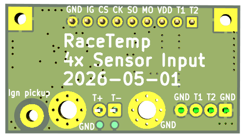

A sensor interface PCB designed and ordered on NiNo's 22 years birthday.  
The PCB has four inputs: 
1) RPM -- engine speed
2) EGT -- exhaust gas temperature
3) NTC1 -- water temperature 
4) NTC2 -- cylinder head temperature
 
